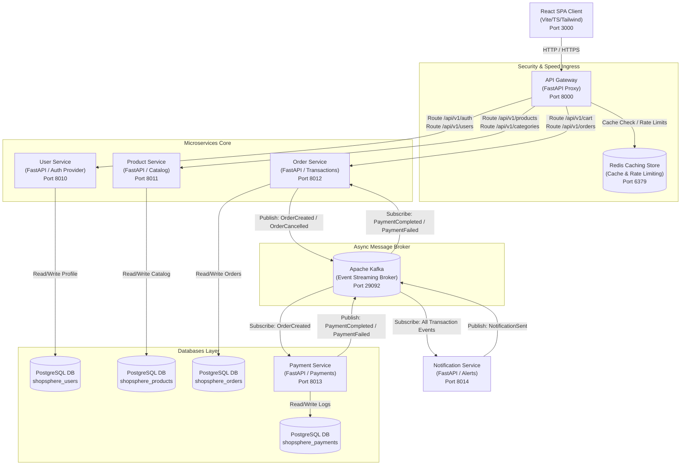

# ShopSphere AI: System Architecture Diagram

This document contains a visual representation of the **ShopSphere AI** platform. It highlights client interactions, gateway proxy routing, state caching, database boundaries, and asynchronous event streams via Apache Kafka.

---

## 🏗️ Architecture Diagram (Mermaid)

---

## 🔍 Architecture Description

1. **Client Layer**: The client React SPA interacts solely with the API Gateway on port `8000`, securing internal services within the private Docker network.
2. **API Gateway Layer**:
   - **Rate Limiting**: Sliding-window limiter checks Redis on every incoming request, blocking abusers with a `429 Too Many Requests` code.
   - **Response Caching**: Read-only routes (`/api/v1/products` and `/api/v1/categories`) are intercepted, fetching directly from Redis to reduce Postgres load.
   - **JWT Validation**: Authenticates access tokens, injecting standard downstream identity headers (`X-User-Id`, `X-User-Role`).
3. **Core Microservices**: Stateless FastAPI apps running business domains independently with private database storage, satisfying database-per-service isolation principles.
4. **Event-Driven Broker (Kafka)**: Inter-service communication uses asynchronous pub/sub messaging. For instance, checkouts trigger an `OrderCreated` event which the `Payment Service` processes, and payment status updates are sent back to the `Order Service` to advance order states without synchronous blocking calls.
